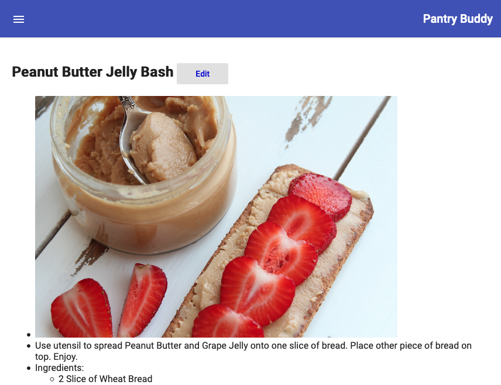

# PantryBuddy

## The only grocery list you'll ever need. Built with NgRx and Angular 6+.

To start an NgRx project from scratch, you can use these commands (at least for Angular 6, Angular CLI 6, RxJs 6, and Angular Material 6):

* `npm install -g @angular/cli`  (you have to have it installed globally to run the CLI commands, but it uses the @angular/cli version specified in a project’s package.json by default — that is, if you’re using @angular/cli@6+ and your project uses @angular/cli@1.7.2, you’ll be fine because it will use version 1.7.2 when working in the project)

* `ng version`  (verifies install)

* `ng config -g cli.packageManager npm`  (or yarn, etc. to set your global ng packageManager config)

* `ng new pantry-buddy —style scss`  (sets up an angular project with SCSS as the style syntax)

* `ng add @angular/material` Add Material

* `npm install @ngrx/{store,router-store,effects,entity,store-devtools}`  Add NgRx tools and dependencies

* `npm install ngrx-store-freeze --save` Add NgRx Store Freeze

* `npm install -g json-server` (CLI for a simple CRUD JSON server)

* `json-server —watch db.json`    (to start json-server)

* `ng generate @angular/material:material-nav --name=app-nav-shell` (create a Sidenav Material component)

* Use app-nav-shell as an app shell and place everything inside it.

This project was generated with [Angular CLI](https://github.com/angular/angular-cli) version 6.1.3.